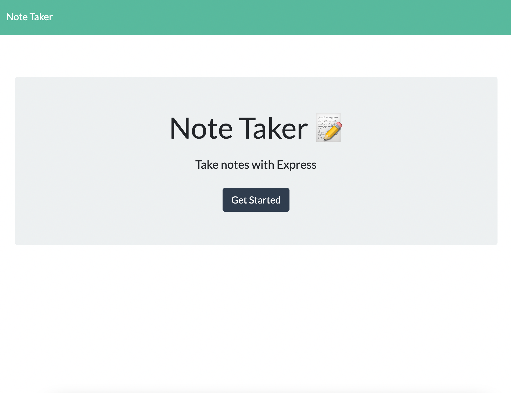
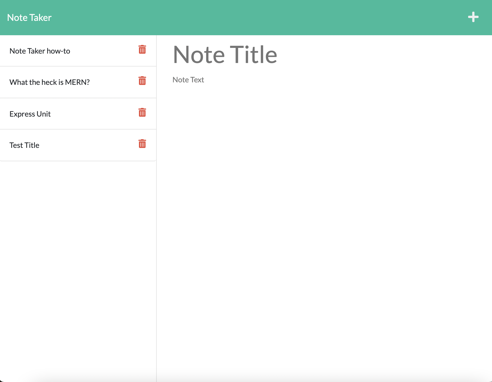
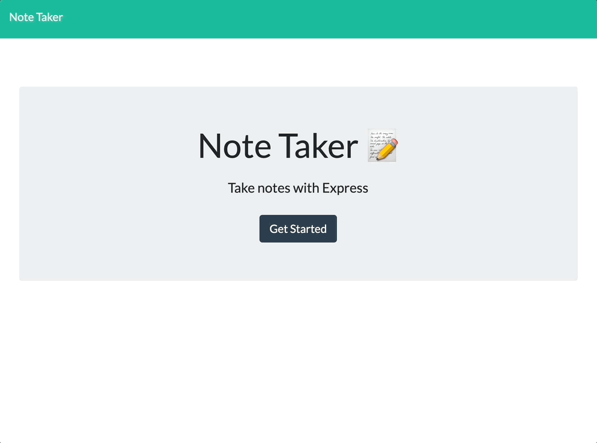
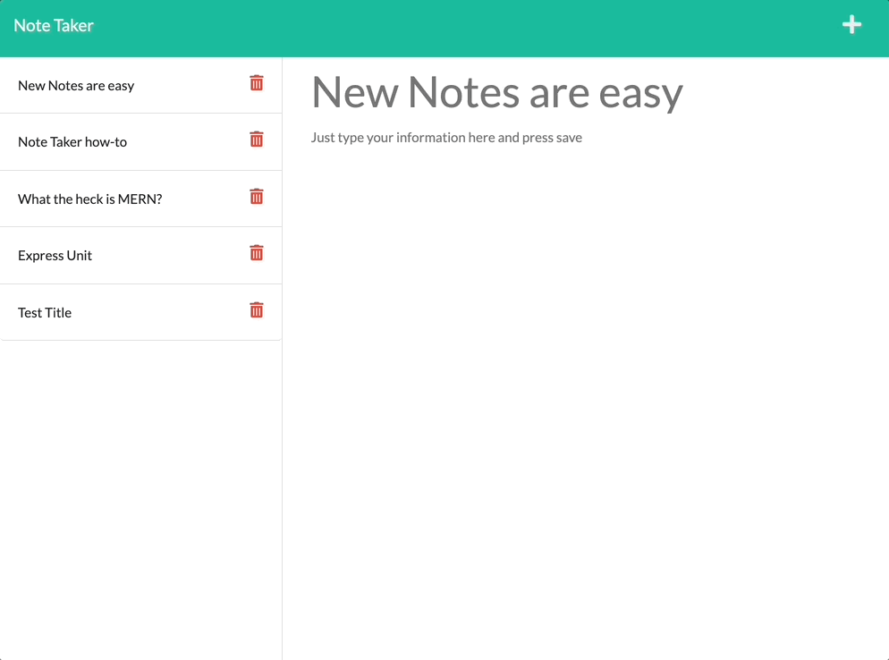

  # Note Taker (powered by Express)

  [](http://opensource.org/licenses/ISC)

  ## Description
  This is a simple to use application that allows the user, a small business owner, to write, save and delete notes. It is powered by an Express.js backend that will save, remove and retrieve note data from a JSON file . This is the user story:

  ```md
    AS A small business owner
    I WANT to be able to write and save notes
    SO THAT I can organize my thoughts and keep track of tasks I need to complete
  ```

  Technologies Utilized:
  Express.js, Javascript, HTML, Bootstrap 5, npm uuid package.

  Challenges and Future Developement Opportunities:
  One thing I tried to keep in mind when developing this application is seperating the routes and Javascript files to make the code easy to navigate. This is ideal. In the future I will hopefully be adding some unit tests, and possibly updating to a more custom looking UI.

  ## Contents

  1. [Installation](#installation)
  2. [Project Usage](#usage)
      1. [Visuals](#visuals)
  3. [Licenses](#licenses)
  4. [Testing](#testing)
  5. [How to contribute](#contributing)
  6. [Project Credits](#credits)
      1. Authors
      2. Additional Acknowledgements
  7. [Have Questions?](#questions)

  ## [Installation](#installation)
  If you plan to run the application on your local machine follow the steps below. I would also recommend starting with a fresh db.json file so that only your notes are present.

  To clone repo: 
  ```md
  git clone git@github.com:jcwashington/Note-Taker.git
  ```
  Run 'npm install' to install necessary dependencies. 
  Run 'npm start' to start the application. Navigate to http://localhost:<PORT>/ Your terminal will let you know what PORT you are running on. 
  When finished, the updated JSON file can be found in the /db directory.


  ## [Project Usage](#usage)
  You can run this application easily from your local computer, but it is also deployed as a Heroku app that can be found here [insert heroku link here](www.herokuapp.com).
  When you open the note-taking application, you are taken to a landing page that links to the notes page.
  
  Your existing notes will be listed in the left-hand column and empty fields to enter a new note title and the note's text will be in the right-hand column.
  
  To begin simply provide a title to the active note. After a title is added, a save icon will appear in the upper right-hand nav bar. 
  When you feel as if you have provided any text that you want associated with the active note, simply press the save icon. The note is now saved and appears in the left-hand column with the other existing notes.
  To view an existing note, click on the note in the left-hand column.
  To create another new note, click on the + in the upper right nav bar
  To delete a note, click the trashcan next to a note in the left bar.

  ### [Visuals](#visuals)
  Creating a new note is as easy as providing a title and then some text. The save icon in the upper right hand corner will save your note to the database JSON file and add it to your list of notes in the left hand bar.
  

  Deleting a note is just as simple
  

  ## [Licenses](#licenses)
  This project uses the ISC license.

  To find out more information on open source licenses, please refer to [https://choosealicense.com/](https://choosealicense.com/).

  ## [Testing](#testing)
  N/A

  ## [How to contribute](#contributing)
  If you would like to contribute to this project, follow the steps below.
  1. Fork the repo on GitHub.
  2. Clone the project to your own machine.
  3. Create a branch for your feature work.
  3. Commit changes to your own branch.
  4. Push your work back up to your fork.
  5. Submit a Pull request so that we can review your changes

  ## [Project Credits](#credits)

  Project Authors:

  [jcwashington](https://github.com/jcwashington)
  

  ## [Have Questions?](#questions)
  Contact the author with your questions:
    *GitHub Username: jcwashington
    *GitHub Email: jasmine.washington412@gmail.com
